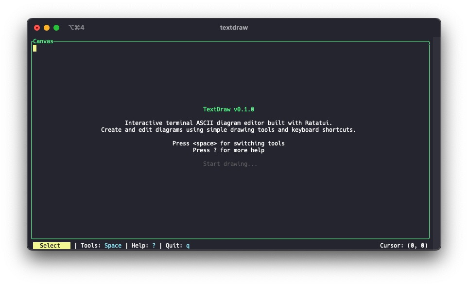

# TextDraw

[](https://opensource.org/licenses/MIT)

An interactive terminal ASCII diagram editor.




## Features

Draw ASCII diagrams directly in your terminal with a Vim-inspired interface. Includes tools for lines, rectangles, arrows, and text. Select and manipulate elements with mouse or keyboard. Save and load diagrams in JSON format. Render diagrams to terminal without opening the editor.

## Installation

### Using Cargo (from GitHub)

```bash
cargo install --git https://github.com/kanatti/textdraw
```

### From Source

```bash
git clone https://github.com/kanatti/textdraw
cd textdraw
cargo install --path .
```

## Usage

### TUI Mode

Start the editor with `textdraw` or open a file with `textdraw diagram.json`.

Select tools with `s` (select), `l` (line), `r` (rectangle), `a` (arrow), `t` (text), or cycle with `Tab`. Click and drag to draw. Press `Space` to toggle tool lock for repeated drawing.

Press `:` for command mode. Use `:w filename.json` to save, `:e filename.json` to open, and `:q` to quit. Press `?` for help.

### CLI Mode

Render a diagram without opening the editor:

```bash
textdraw --render diagram.json
```

## Project Status

TextDraw is in active development. Current features are stable, but the API and file format may change before v1.0.

## Contributing

Contributions are welcome! Please feel free to submit issues or pull requests.

## Author

Balagopal Kanattil Shaji ([@kanatti](https://github.com/kanatti))
